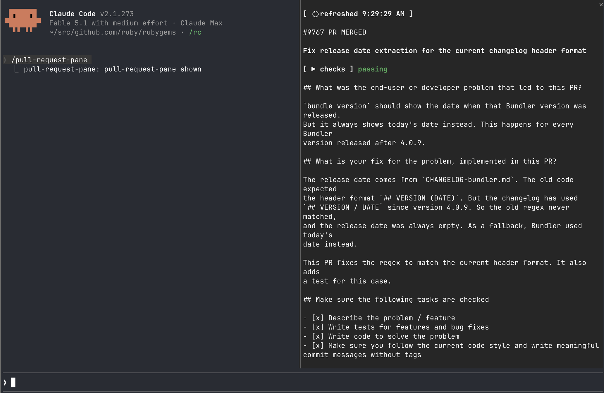

# pull-request-pane

[](https://github.com/meganemura/pull-request-pane/actions/workflows/test.yml)



A Claude Code plugin (a Claude Mod) that shows the GitHub pull requests
related to the current session in a pane beside the transcript.

- Drag over an entry's title or description to leave a comment on that span.
  Add as many as you like, across either field, plus one comment on the
  entry as a whole, then press Submit to send them all as one prompt.
- While the pane is open, each pull request's checks, review decision and
  mergeability refresh on a timer.

Issues that a pull request closes, and issues the transcript mentions, appear
as entries too, with a line between a run of pull requests and a run of
issues so the two do not read as one list of the same kind of thing.

## Requirements

- Claude Code 2.1.273 or later with `CLAUDE_CODE_ENABLE_FUNCTION_HOOKS=1`
- `gh` logged in to GitHub

## Install

```sh
claude plugin marketplace add meganemura/pull-request-pane
claude plugin install pull-request-pane@pull-request-pane
```

Set `CLAUDE_CODE_ENABLE_FUNCTION_HOOKS=1` for every session, instead of prefixing each `claude`
invocation, by adding it to `settings.json`'s `env`:

```json
{
  "env": {
    "CLAUDE_CODE_ENABLE_FUNCTION_HOOKS": "1"
  }
}
```

Type `/pull-request-pane` to show or hide the pane.

To develop against a checkout instead, run the plugin straight from its working tree:

```sh
CLAUDE_CODE_ENABLE_FUNCTION_HOOKS=1 claude --plugin-dir /path/to/pull-request-pane/plugin
```

## Refresh

A `↻ refreshed <time>` button sits above the entries (`↻ reading…` before the first one lands).
Press it to refetch every entry's title, description and checks right now, instead of waiting
for the next automatic refresh or the 60-second poll — the poll's own schedule restarts from the
press. An entry with review activity in progress (see below) is protected from this, the same
way it is protected from the automatic refresh a turn or a `gh ` command triggers.

## Leave review comments

Each entry shows its identifier (`#<n> PR <state>` for a pull request, `#<n> Issue <state>` for
an issue) as a link to it on GitHub — hover it and it highlights — then a blank line, its
bold title, another blank line, its checks (a pull request only, its status word bold too),
another blank line, then its full description. Drag over the title or the description to open a
comment box for that span: the covered text highlights as you drag, and releasing opens a
`comment` field under the entry with the span quoted above it. Type a comment and press Enter to
add it — the field is dropped, and the comment appears in a list under the entry, with an `x`
button to remove it. Press Enter with an empty field to drop the span with no comment. Repeat as
many times as you like, over either field; an always-present `overall` field takes one comment
on the entry as a whole, the same way.

Press Submit to send every comment for that entry as one prompt: a header naming the entry, then
each comment with the text it was about quoted above it, the overall comment last. Submit
refuses — the status line says why — while a comment field still holds text Enter has not added,
or with nothing to send at all.

An entry's title and description stop refreshing while it has any review activity (a pending
selection, a committed comment, or unsent text in a comment field), so nothing a comment quotes
changes out from under it before you press Submit. Checks, review decision and mergeability keep
updating live on their own 60-second poll regardless — they have nothing to do with the text.

## Checks, review and mergeability

Each pull request's status is fetched once as soon as the pane opens, and every 60 seconds
after that while it stays open. A pull request with no status yet shows `fetching checks…`;
the footer below the entries reads `status updating…` while a fetch is in flight, `status
<time>` once it lands. Once fetched, it draws as a `▶ checks` toggle and one coloured word —
`failing` (red), `running` (yellow), `passing` (green), or `no checks` — so you can tell at a
glance whether to look further. Press the toggle for the detail: a summary line (`✓<pass>
✗<fail> …<pending> · <review decision> · <mergeable>`), then each check by name, coloured by
its own outcome and linked to its run (GitHub Actions, CircleCI, whatever produced it) where
one exists — hover a linked check and it highlights, so it reads as clickable. Issues have no
status.

Each entry's description is drawn in full below its title and status. A line wider than the pane
wraps onto as many screen rows as it needs, and a drag's position still matches the right
character across the wrap.

## Persistence

Opening the pane, or the pane's own data changing, is saved to this plugin's own store, so a
reload of this file (developing against it under `--plugin-dir`, or any other reload the engine
does on its own) shows the last known entries right away instead of `reading…` — a background
refresh catches up from there once you next interact with the session.

## Status

Early access. The function-hooks API can change between Claude Code
releases without notice.
